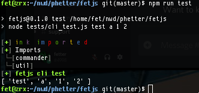

# fetjs

# Summary

fetjs is a small library that makes a common pattern that I develop with more convenient.




# Setup
```
npm install
npm run test
```

See tests/cli_test.js for more a code example.
